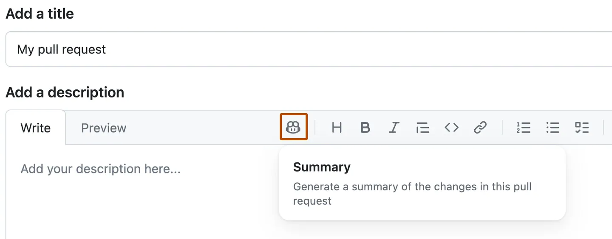
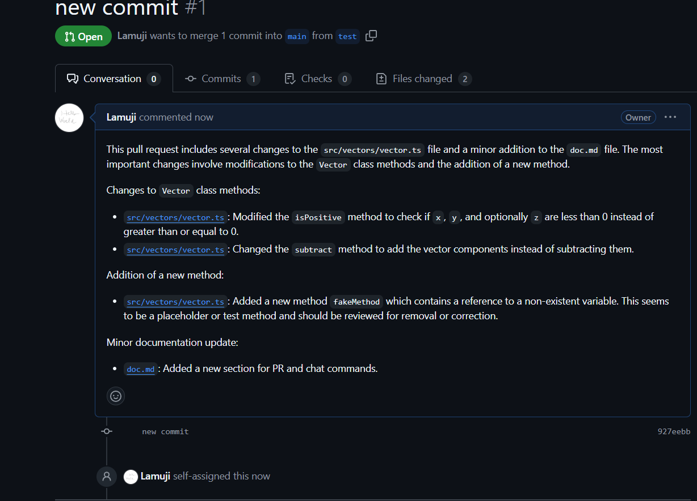
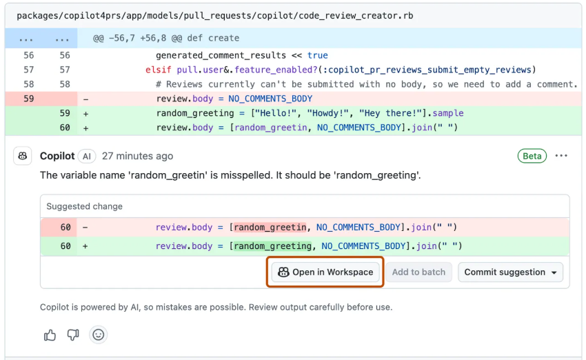
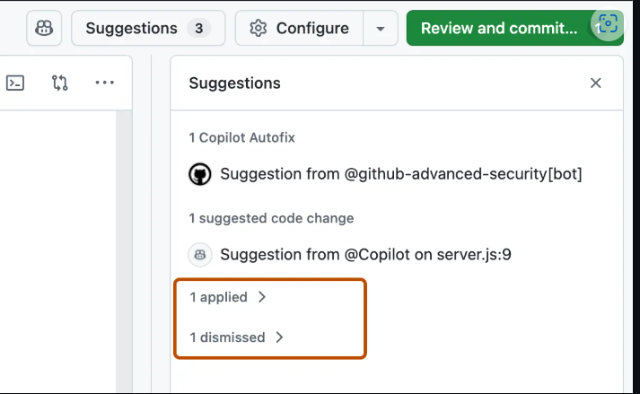

# Copilot for PR

## GitHub Copilot Free

Il n'y a, pour le moment, aucune fonctionnalite inherente aux PRs sur cette version de GitHub Copilot.

## GitHub Copilot Pro

### Summary de PR

Directement dans le menu de Pull request de GitHub, nous pouvons utiliser GitHub Copilot pour generer un resume d’une PR. Cela permet aux reviewers d'avoir deja une idee des modifications effectuees.

GitHub Copilot analyse la pull request et fournit un aperçu des changements en prose, ainsi qu’une liste à puces des changements et des fichiers concernes. On peut generer un resume dans les cas suivants :

*   Dans la description d’une nouvelle pull request que l'on cree
*   Dans la description d’une pull request existante, en modifiant le commentaire initial
*   Dans un commentaire sur la timeline principale d’une pull request

exemple d'un summary genere:

**Utilisation Responsable** : 
Il est important de noter que les resumes générés par Copilot sont là pour aider à la comprehension des PR, mais ne doivent pas remplacer une revue humaine. Il est de notre responsabilite de verifier l'exactitude des informations dans une pull request.

### Travailler sur une PR avec Copilot Workspace

Apres avoir cree une pull request, on peut continuer à travailler dessus dans l'interface GitHub grace à Copilot Workspace, qui fournit un environnement compatible avec Copilot.

Copilot peut nous aider à :

*   Écrire un resume de pull request
*   Examiner une pull request
*   Suggerer des corrections pour les problemes identifies par l'analyse de code CodeQL

**Édition des fichiers**

*   Accès a tous les fichiers du projet (modifiés ou non)
*   Visualisation des changements en mode diff
*   Modifications sur plusieurs fichiers simultanement
*   Messages de commit auto-generes par Copilot
*   Selection granulaire des fichiers à inclure dans le commit

**Gestion des commentaires**

|  |   |
|---|---|
|  |  |

*   Navigation sequentielle dans les commentaires de la PR
*   Interface dediee pour les suggestions de code
*   Options d'acceptation ("apply") ou rejet ("dismiss") des suggestions
*   Suivi des suggestions traitees et en attente
*   Application groupee des changements en un seul commit

**Chat Copilot integre**

*   Questions sur le fichier en cours d'edition
*   Analyse de la PR complete
*   Support technique general

> **Note**: Le chat Copilot est actuellement en preview publique
